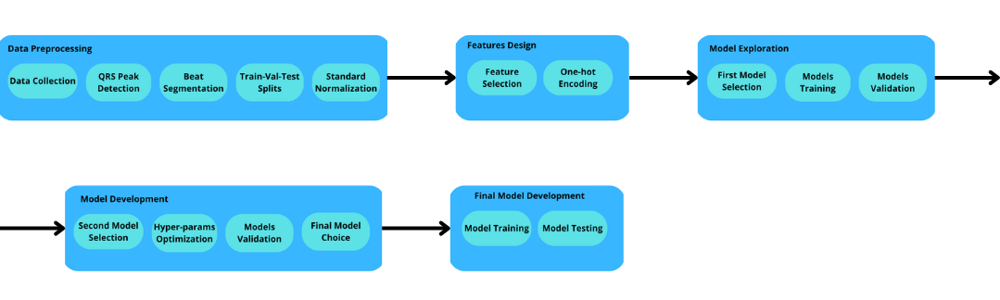
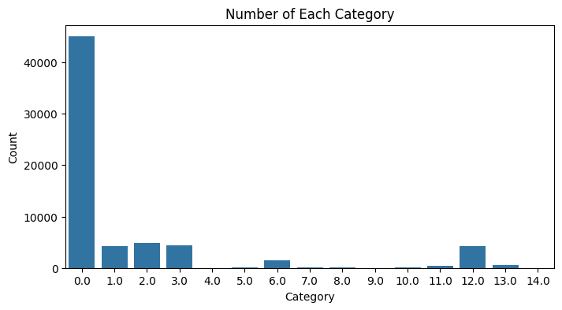
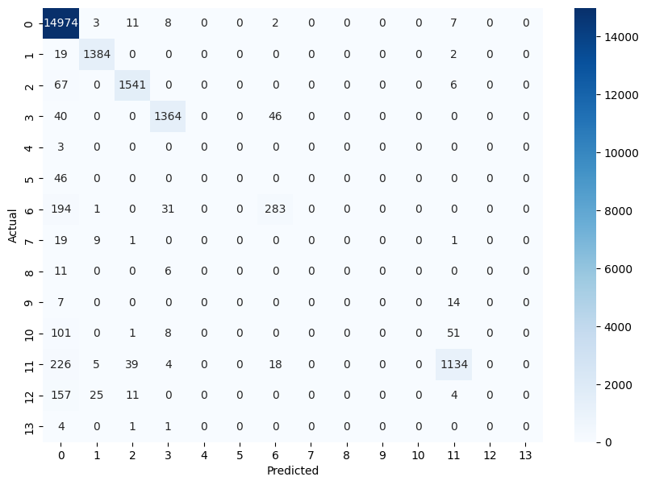
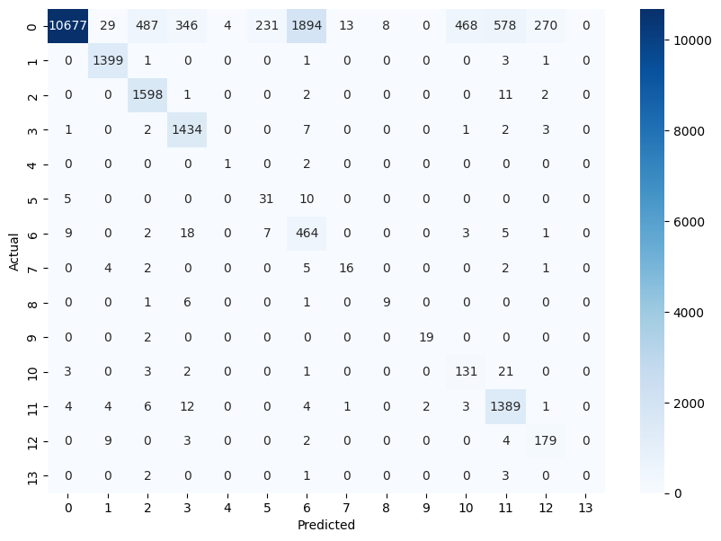
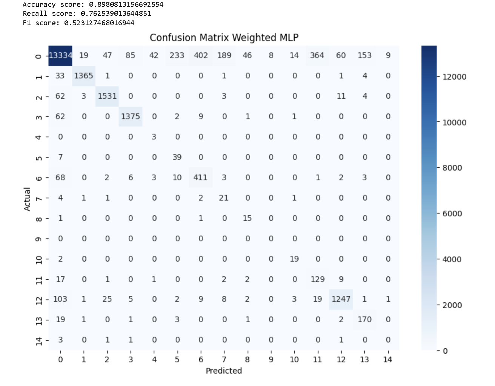
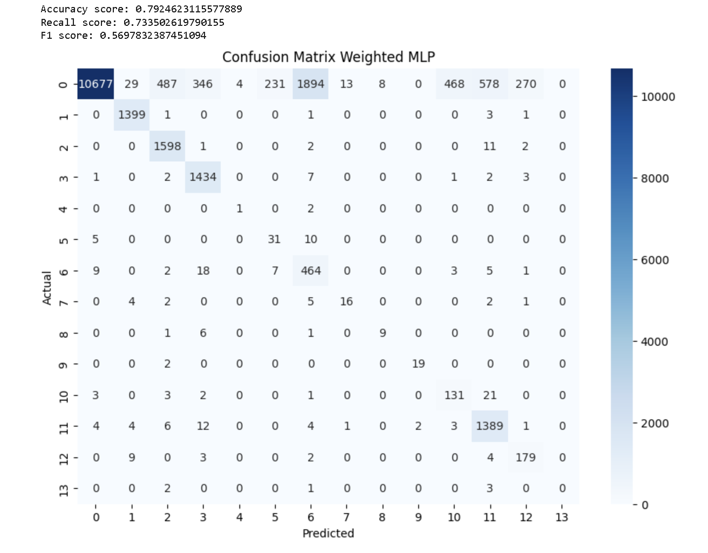
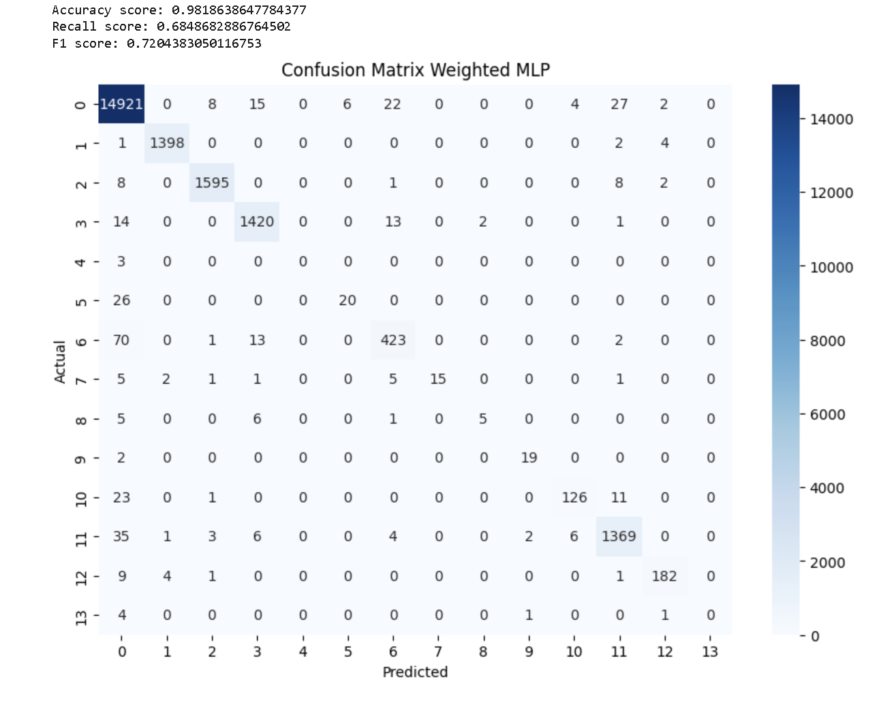

# Project CE_ARR — Final Report

**EE4C12 Machine Learning for Electrical Engineering Applications**  
**Group members:**  
- **Azat Idayatov** (aidayatov@tudelft.nl, Student ID: 6551505)  
- **Giorgio Recchilongo** (grecchilongo@tudelft.nl, Student ID: 6549632)  

---

## Summary

This project aimed to classify different types of cardiac arrhythmias in patients using ECG data and machine learning. Multiple model architectures were explored, including Multi-Layer Perceptrons (MLPs), Support Vector Machines (SVMs), Logistic Regression, and tree-based ensembles (Random Forest, LightGBM). To address class imbalance, we used class weighting and SMOTE oversampling.  
After hyperparameter tuning, the LightGBM model performed best, achieving a **macro-F1 score of 0.76**, **macro-accuracy of 0.98**, and **macro-recall of 0.75** on the test set, demonstrating the effectiveness of gradient boosting for this unbalanced classification task.

---

## ML Pipeline

*Figure 1: Pipeline of the ML algorithm development*

The machine learning workflow consisted of the following steps:

1. **Data Preprocessing**:  
    - ECG data acquisition  
    - QRS peak detection using the Pan Tompkins Algorithm  
    - Beat segmentation (one beat per sample)  
    - Splitting into train, validation, and test sets  
    - Standard normalization (fit on training data to avoid leakage)

2. **Feature Design**:  
    - One-hot encoding of target labels

3. **Model Exploration**:  
    - Training and validation of baseline models  
    - Comparison of initial performance

4. **Model Selection and Tuning**:  
    - Hyperparameter search on best models  
    - Re-evaluation on validation set

5. **Final Evaluation**:  
    - Training on all training data  
    - Testing on the unseen test set

---

## Task 1: Model Selection

### Models Evaluated

- **Linear Models** (Logistic Regression, LinearSVC): Fast baselines to test for linear separability.
- **Non-Linear SVM** (RBF Kernel): To examine non-linear boundaries, despite higher computational cost.
- **Tree-Based Ensembles** (Random Forest, LightGBM): To test robustness and efficiency on structured data.
- **Multi-Layer Perceptron (MLP)**: Including variants with class weighting, SMOTE, and random undersampling.

### Performance Metrics

- **F1-score** was the primary metric (harmonic mean of precision and recall), prioritizing minimization of false negatives due to clinical significance.
- **Macro-averaging** was used to ensure class balance in evaluation.

### Handling Imbalanced Data

The dataset had over 65,000 samples, but some classes had as few as 2 examples (see below). To compensate, we always reported **macro-averaged metrics**.

*Figure 2: Sample class distribution*

### Results

| Model                        | Recall (Macro) | F1 (Macro) |
|------------------------------|---------------|------------|
| Simple MLP                   | 0.37          | 0.38       |
| Weighted MLP                 | 0.67          | 0.30       |
| SMOTE MLP                    | 0.62          | 0.45       |
| Downsampled MLP              | 0.76          | 0.52       |
| Random Forest                | 0.73          | 0.57       |
| Gradient Boosting (LightGBM) | 0.68          | 0.72       |
| SVC RBF                      | 0.86          | 0.61       |
| Downsampled SVC RBF          | 0.79          | 0.49       |
| SVC Linear                   | 0.59          | 0.30       |
| Logistic Regression          | 0.69          | 0.35       |

*Table 1: Validation performance of baseline models (macro-averaged)*

- Linear models performed poorly, indicating non-linearity.
- SVC (RBF) and tree-based models performed better, with LightGBM providing the best F1 and fastest training.
- Among MLPs, random undersampling of the majority class gave the best results.

#### Example Confusion Matrices

| Simple MLP | Random Forest |
|:----------:|:-------------:|
|  |  |

---

## Task 2: Model Selection and Optimization

The following models were selected for further optimization:

- Downsampled MLP
- Random Forest
- Gradient Boosting (LightGBM)

SVC (RBF) was not optimized further due to high computational cost.

### Methodology

Hyperparameter tuning was performed using `RandomizedSearchCV` with 20 random parameter combinations and 3-fold cross-validation.

### Results Before and After Optimization

**Before optimization:**

| Model              | Accuracy | Recall (Macro) | F1 (Macro) |
|--------------------|----------|----------------|------------|
| Downsampled MLP    | 0.90     | 0.80           | 0.55       |
| Random Forest      | 0.93     | 0.55           | 0.61       |
| LightGBM           | 0.94     | 0.69           | 0.68       |

**After optimization:**

| Model              | Accuracy | Recall (Macro) | F1 (Macro) | Recall (Weighted) | F1 (Weighted) |
|--------------------|----------|----------------|------------|-------------------|---------------|
| Downsampled MLP    | 0.90     | 0.76           | 0.50       | 0.85              | 0.88          |
| Random Forest      | 0.97     | 0.61           | 0.66       | 0.98              | 0.97          |
| LightGBM           | 0.98     | 0.71           | 0.72       | 0.98              | 0.98          |

*Table 2: Validation performance after optimization*

### Example Optimized Confusion Matrices

- **Downsampled MLP:**  
  
- **Random Forest:**  
  
- **LightGBM:**  
  

---

## Final Model Results

**LightGBM** was selected as the final model. On the test set, it achieved:

| Metric                | Score   |
|-----------------------|---------|
| Accuracy              | 0.9796  |
| Recall (Macro)        | 0.7492  |
| Recall (Weighted)     | 0.9796  |
| F1 Score (Macro)      | 0.7645  |
| F1 Score (Weighted)   | 0.9794  |
| Precision (Macro)     | 0.7958  |
| Precision (Weighted)  | 0.9794  |

*Table 3: Final metrics for LightGBM on the test set*

---

## Conclusion

This project explored and compared multiple machine learning models for arrhythmia classification from ECG data. The main challenge was severe class imbalance, which was mitigated through class weighting, oversampling, and careful metric selection.  
Tree-based ensembles, especially **LightGBM**, clearly outperformed linear models and basic neural networks, achieving a macro F1-score of 0.76 and high accuracy. Gradient boosting is an effective approach for such unbalanced medical classification problems.

---
